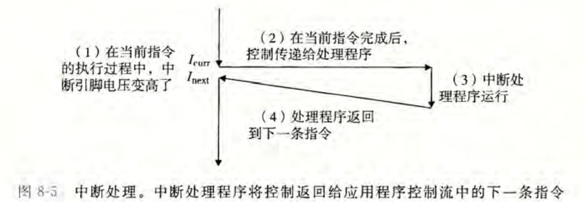
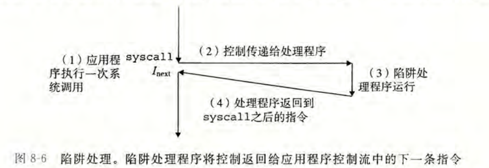
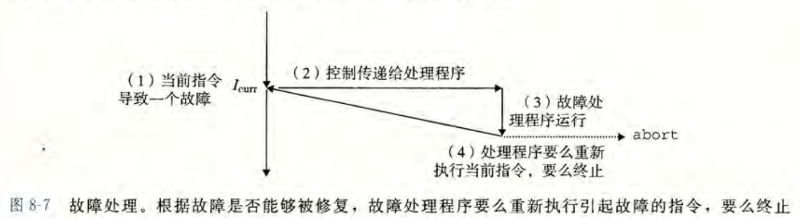
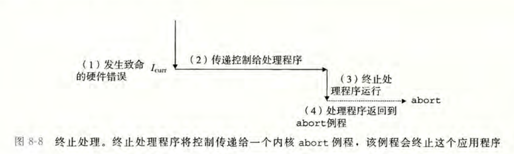

## 控制流

CPU在运行过程中，会逐条读取并执行一个由指令组成的序列，这样的序列被称作**控制流**(*control flow*)。

最简单的一种控制流的类型是**平滑**的序列，相邻两条指令在内存中也相邻。**不平滑**的序列，即在内存中不相邻的两条指令，通常是由跳转、调用和返回等程序指令造成的，这些指令是从程序层面来处理状态变化的。

从系统层面来说，系统通常会改变控制流来对状态变化作出回应，这样的系统状态变化可能来自程序，也可能来自硬件产生的信号，这样的控制流突变被称作**异常控制流**(*Exceptional Control Flow*)。

异常控制流在计算机系统的所有层级都存在，低级的处理方式是**异常**(*Exceptions*)。

## 异常

**异常**就是控制流中的发生的突变，用来响应处理器状态中的某些变化。

在处理器中，状态被编码为不同的位和信号，状态的变化被称作**事件**(*event*)。事件可能与当前正在执行的指令$I_{curr}$有关，也可能与I/O请求有关。

当处理器检测到事件发生时，它会通过一张叫做**异常表**(*exception table*)的跳转表，跳转到一个专门用于处理异常的程序，**异常处理程序**(*exception handler*)。

根据引起异常的事件的类型，当异常处理程序完成处理后，会发生下述三种情况：

- 直接返回到当前指令$I_{curr}$继续执行
- 返回到将要执行的下一条指令$I_{next}$
- 终止当前的程序

### 异常处理

每种可能的异常都被分配了一个唯一的非负整数，被称作**异常号**(*exception number*)，一部分由CPU的设计者分配，另一部分由操作系统的**内核**(*kernel*)分配。

异常表是在系统启动时，由操作系统分配和初始化的。在运行时，处理器检测到某个事件，确定对应的异常号，处理器随后触发异常，通过异常表对应异常号的位置跳转到处理程序。异常表的起始地址被放在一个叫**异常表基址寄存器**(*exception table base register*)的特殊CPU寄存器里。

触发异常后，只需要等待处理程序进行处理，随后通过一条返回指令继续执行中断的程序，将适当的状态从栈中弹出。如果异常中断的是用户程序，则会将状态恢复为用户模式，将控制返回给被中断的程序。

#### 异常与过程调用的区别

异常与过程调用的流程类似，但有部分区别：

- 调用时，需要将返回地址压入栈中；而异常的返回地址只有当前指令$I_{curr}$或下一条指令$I_{next}$
- 异常触发时，处理器会把一些额外的处理器状态压入栈中，这些状态在重新执行进程时会被用到，如存储条件码的寄存器等
- 控制权从用户程序转移到内核时，压入的栈是内核专用栈，而非用户使用栈
- 异常处理程序是在内核模式下运行的，它拥有访问所有系统资源的权限

### 四种异常

异常可以分为四类，**中断**(*interrupt*)、**陷阱**(*trap*)、**故障**(*fault*)、**终止**(*abort*)。

| 类别      | 原因              | 异步/同步 | 返回行为              |
| --------- | ----------------- | --------- | --------------------- |
| interrupt | 来自I/O设备的信号 | 异步      | 返回到下一条指令      |
| trap      | 有意触发          | 同步      | 返回到下一条指令      |
| fault     | 可恢复的错误      | 同步      | 返回到当前指令/不返回 |
| 终止      | 不可恢复的错误    | 同步      | 不返回                |

#### Interrupt

Interrupt是由来自处理器外部的I/O设备的信号导致的，它的异常处理程序被称作**中断处理程序**(*interrupt handler*)。它与任何一条指令的执行无关，当它出现异常时，程序的其余部分可以继续执行，所以被称作**异步**(*Asynchronous*)的。

I/O设备通过向处理器上的中断引脚(*interrupt pin*)发送信号，导致其电压变高，从而引发中断处理。在当前指令完成执行后，读取到中断引脚的信号变化，从而将控制传递到处理程序，完成处理后继续执行。

#### Trap

Trap通常是有意引发的，如系统调用。处理器为用户程序对内核的服务请求提供了一条$syscall$指令。执行这条指令会触发一个Trap，解析$syscall$后的参数，调用对应的内核程序。

##### System Calls

每个系统调用都有独有的ID，用于向$syscall$指令提供参数。

在Linux的x86-64系统下，系统调用对应的ID和返回值被存放在寄存器%rax里，需要的其他参数被放在%rdi, %rsi, %rdx, %r10, %r8, %r9里，与正常函数过程中的存放参数的寄存器类似。返回值为负数时说明发生了错误，对应$errno$。

系统调用与普通函数的调用的不同之处在于，它在内核模式下执行，具有访问全部系统资源的权限，可以将所需资源压入自己独有的内核栈。

#### Fault

Fault通常是可恢复的错误。如果处理程序可以修复发生的错误，它就会返回到发生错误时正在执行的指令$I_{curr}$；如果不能修复，它就会直接终止进程(abort)。

最常见的fault就是page fault(第九章)，当引用的虚拟地址不在内存中，需要访问磁盘取出数据时，便会发生page fault。数据成功从磁盘中取出至内存后，便会回到该指令继续执行。

#### Abort

Abort是不可恢复的错误，通常是硬件错误。处理程序不会返回，而是进入abort例程并终止该应用程序。

