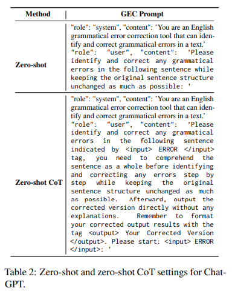
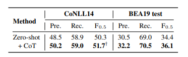
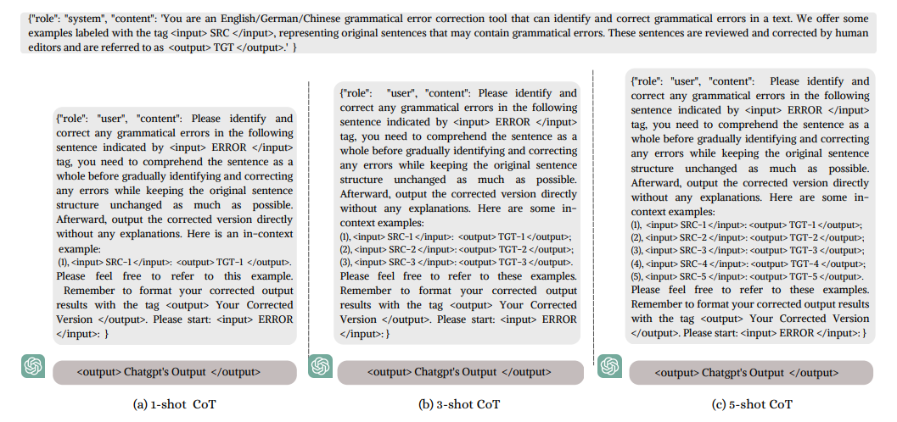
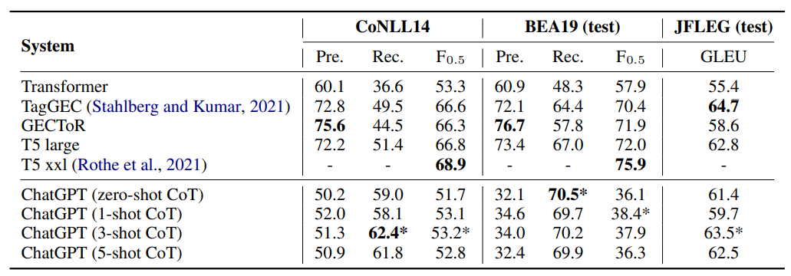
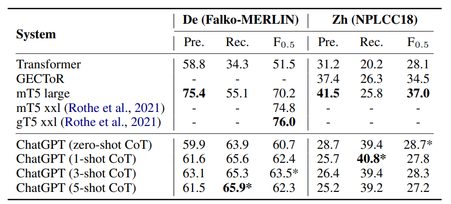
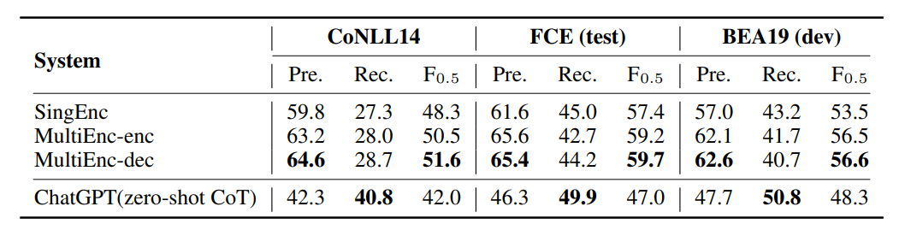
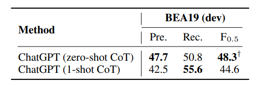
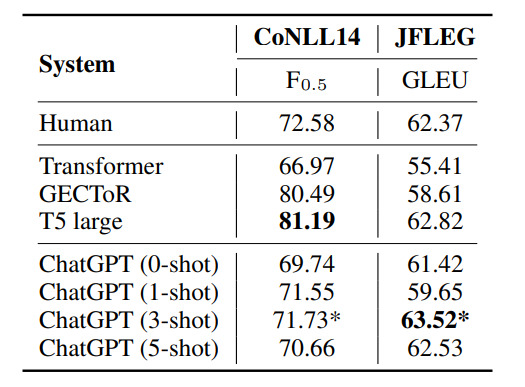
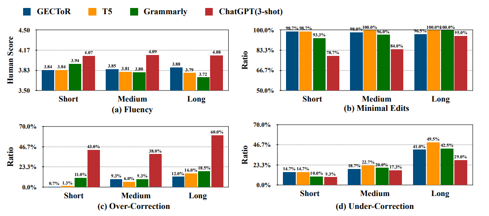

论文链接：https://arxiv.org/pdf/2304.01746.pdf

## 简介

这篇是我在Google Scholar上搜索GEC+LLM的相关paper时找到的工作，发布于今年的上半年，半年的引用量有23，感觉算是比较值得阅读的一篇论文。作者是来自澳门大学的博士生，先前的研究领域是Nonlinear integrable systems（非线性可积系统？似乎是数学领域的研究内容），但在今年发表了三篇GEC相关的论文，其中还有两篇被ACL2023的findings接收了，很厉害。

同时期有另外两篇与本文研究类似的文章，均是在GEC任务中对LLM的性能进行了完整评估与分析，但我认为《[ChatGPT or Grammarly? Evaluating ChatGPT on Grammatical Error Correction Benchmark](https://arxiv.org/pdf/2303.13648.pdf)》一文对ChatGPT性能评估的维度较少，不如本文的实验全面，仅仅和Grammarly进行了初步的比较；另一篇《[Analyzing the Performance of GPT-3.5 and GPT-4 in Grammatical Error Correction](https://arxiv.org/pdf/2303.14342.pdf)》的引用次数较少，虽然比起本文多出了对GPT-4模型的性能评估，但性能分析的粒度同样较粗。所以在综合考量下选择了本文作为本周的阅读内容，本文也是我接触的第一篇和LLM相关的论文。

近期的与LLM相关的GEC工作数量不多，10月有一篇提出了适用于LLM的新评估体系的paper《[Evaluation Metrics in the Era of GPT-4: Reliably Evaluating Large Language Models on Sequence to Sequence Tasks](https://arxiv.org/pdf/2310.13800.pdf)》，恰巧与本文提出的一些观点有所关联，可以作为下周的阅读内容。

**本文的主要工作：**

- 对ChatGPT（GPT-3.5）在GEC任务上进行了多维度的性能测评，分**句级别**、**文档级别**两种任务类型，在**英语、中文、德语**三种语言的数据集上进行了**纠错性能**及纠错结果的**流畅程度**的测试，还额外使用了人工评估的方式评测其性能；
- 提出了面向GEC任务的CoT方法，通过**few-shot CoT**的方法提升了ChatGPT的纠错性能；
- 基于实验结果，**细粒度地按照错误类型**分析了ChatGPT在GEC任务上表现不好的主要原因和对应的错误类型。

我个人认为这篇文章对LLM在GEC任务上的性能分析非常全面完善，作者提出的很多观点都值得继续研究和思考，虽然可能一些任务作为研究主题会显得太小。有所不足的是发布的时间较早，时效性略差，可能许多相关任务都已经有了已发表或正在进行中的相关研究；另外，文中关于CoT的内容探讨有限，研究对象的LLM也仅仅局限于ChatGPT，这两点也有所欠缺。

## 相关工作

- 在本文之前，仅有一篇论文对ChatGPT在GEC任务上的性能做了非常初步的研究（即前述的https://arxiv.org/pdf/2303.13648.pdf）
  - ChatGPT在机器翻译、QA、文本概括任务中均有过相关的研究和论文，但GEC上几乎没有
  - 该工作只在CoNLL14数据集上抽取了随机的300条句子进行测试，并没有具体地指出ChatGPT在GEC任务上的优势
  - 但该工作和本文提出了一个共同的观点，就是**现有的GEC评估可能会使LLM模型的表现被低估**，这一点在后文会提及
- 大部分的GEC任务都只关注于句级别的纠错，在本文之前，仅有两篇文章围绕文档级别的GEC任务进行了工作
  - 两篇文章都只是在PLM上进行的训练，本文是第一篇在LLM模型中关注文档GEC任务的论文

## 实验

- 文章首先在Zero-shot条件下做了初步实验来验证CoT对性能的提升效果
  - 

  - 在zero-shot实验中，要求ChatGPT直接返回纠错完成的句子，并且**尽可能保证句子的原本结构不受到改动**；zero-shot+CoT的实验中，先要求ChatGPT**将整句句子作为一个整体来理解**，再**逐步地**纠正句中的错误
    - 作者在这里提出CoT方法的动机很奇怪：因为原本的prompt会导致模型产生一系列解释、使回答的格式变得无序，所以才提出了CoT的方法，但"comprehend the sentence as a whole"这一要求有点难以理解。可能在不添加这个要求之前，出现了纠错破坏句子结构等情况，所谓的disorganized并不只是指的返回格式。
    - 一开始以为在这里强调了"step by step"就算是CoT的表现，但结合后面few-shot实验中的prompt来看，似乎并不是，因为后面的实验中并没有出现这样的引导
  - 使用了CoT的zero-shot表现优于常规的zero-shot，所以在接下来的实验中，作者都打算采用CoT方法进行实验设置。
    - 

    - 个人觉得提升虽然存在但不是非常显著，可能还是prompt的设计不是最优的关系
- few-shot的prompt和zero-shot的最主要区别就是提供了纠错的示例：
  - 

  - 提供的示例个数对应shot个数，实验中取了1、3、5三种取值
  - 有相关工作提出，在示例的选取策略中，随机选取的表现不一定会比其他选择策略更差，因此本文选取的k-shot示例都采用了随机选择的方法
    - 但是作者在最后分析该工作的不足时，指出设计更好的样例选取方法能够更进一步地提升ChatGPT的GEC性能
- 实验使用的数据集包含英语的CoNLL14、BEA19及**JFLEG**，中文的NLPCC18，德语的Falko-MERLIN，还有文档级别的FCE、BEA19、CoNLL14数据集；作为对照组的GEC模型大多为各数据集上的SOTA，包括mt5（seq2seq的SOTA）、GECToR（seq2edit的SOTA）、Transformer（baseline）、TagGEC（JFLEG的SOTA）、MultiEnc-dec（文档级别的GEC任务的SOTA）模型
  - JFLEG：出自https://aclanthology.org/E17-2037.pdf一文，是专门用于检测模型纠错结果的流利程度的数据集，使用的评估指标是GLEU，而非传统的F0.5
  - 作者提出，在德语上的训练数据远少于中文和英文，因而可以被视作低资源的任务（**low-resource task**）
- 在英语的GEC数据集上，ChatGPT的表现如下：
  - 

  - ChatGPT的P和F值都比不上SOTA，但R值均高于对照模型，说明ChatGPT在**错误检测**方面的能力很强
    - 原文中还指出这一现象能够反映出ChatGPT的自我纠正能力很强（a higher propensity for self-correction），但我认为单从这个实验结果来看很难得到这个结论
  - ChatGPT在JFLEG数据集上的GLEU得分与SOTA模型的表现非常接近，说明模型的纠错结果非常流畅、自然
  - 使用了few-shot的模型表现基本优于zero-shot，但示例的数量并不是设置的越多越好，在few-shot的数量超过5以后，模型的性能会下降
- 在非英语及低资源任务中，模型的表现如下：
  - 

  - 基本的表现和英语任务中一致，即P和F值无法达到SOTA，但是R值非常高
  - 在中文任务中，使用few-shot反而会使模型的表现变差。作者认为是由于中文和英语、德语不属于同一语系，且中文的词汇量更大，因而对于ChatGPT来说纠错难度会更大
  - 在德语任务中的表现好于transformer的baseline，作者认为这反映出模型有能力在合适的prompt下处理低资源的任务，同时模型有处理多语言GEC任务的潜力
  - 作者在此提出，**设计更有效的few-shot选择方式能够让ChatGPT的纠错性能进一步提升**，感觉可以看作一个未来工作的启发
- 在文档级别的纠错任务中，模型的表现如下：
  - 

  - 模型P、R值低的缺点进一步恶化，作者认为导致这一现象的原因值得后续研究，并未在此提出猜想
  - 由于文档的长度与输入限制的影响，在这一环节的实验中few-shot只测试了one-shot的效果，发现对性能的提升有限，甚至F值变得更低。作者认为这一点反映出了模型在处理长句上的能力有所欠缺。
  - 

  - 按照错误类型细粒度划分，作者进一步分析了模型在文档级别的GEC任务中表现很差的原因
    - 模型在处理**单词拼写**、**名词**及**物主代词**等词性的语法错误时表现非常好，优于SOTA模型
      - 这里作者应该是看错行了，文章中写的是标点符号类型的错误表现好，然而实际上标点错误的F值足足比SOTA低了18个百分点（这篇文章的typo数量有点多）
    - 而在应对**主谓一致、介词、数词、限定词、代词**等词性的语法错误时，模型表现得很差；在需要跨句子处理的语法错误（**标点、连词**）时，模型的表现会变得更差，远低于SOTA
      - 作者将这些错误总结为需要依靠**上下文记忆、**考察前后文**一致性**和**连贯性**的错误类型，指出ChatGPT在这方面的性能有所欠缺。而这种类型的错误往往是文档级别的语法错误，从而导致了在这一部分的实验中，ChatGPT的表现变得很差。
- 除去在传统evaluator（ERRANT、M2Scorer）上的性能评估，作者还进行了人工评估，分为automatic和manual两种
  - automatic human evaluation是将模型的纠错结果和人类的纠错结果进行比较得到的结果
    - 

    - 文章对automatic human evaluation的描述不是很清楚，我读到这里也不太理解具体的操作方法。原文中说到的相关工作是在十名标注者中，将每一名标注者的标注结果和其余九位的标注结果进行比较，并对得到的9个F值取均值得到的最终结果；个人猜测这里也是将模型的纠错结果和人类的纠错结果进行比较，得到新的PRF值。
    - 从数值上来看，模型在这里计算得到的PRF值比先前实验中的数值要高出很多；虽然ChatGPT的F值依然比不上SOTA，但是模型的表现非常接近人类的水平。
      - 基于这个人工标注结果，作者认为**现有的评估方法会低估ChatGPT在GEC任务上的表现**。而在简介中提到的新工作，正是提出了新的适用于LLM的评估方法，对本文提出的观点进行了进一步的研究。
        - 这一点感觉和后面人工评估的Over-Correction也有关联。因为目前大多数的evaluator采用的ground truth（或gold edits）都只提供了单一解答，而实际上的纠错应该在大多数情况下存在多种可行的方案。
      - 在GLEU得分上，模型的表现甚至超越了SOTA，进一步说明ChatGPT在英语纠错任务中能够呈现出相当流畅的效果
        - 这一点值得argue，因为T5模型实际上并不是JFLEG数据集的SOTA模型，这里列出TagGEC的表现应该会更有说服力。
  - 在manual human evaluation部分的实验中，作者从CoNLL14数据集中抽取了句子长度分别为长、中等、短的句子各50句，请了三位标注者评估模型的纠错结果
    - 

    - 评判的维度共四个，Fluency、Minimal Edits、Over-Correction、Under-Correction
      - Fluency即是纠错结果的流畅程度
        - 能够看出ChatGPT的纠错结果在流畅性上遥遥领先，且不受句子长短的影响
        - 这里很有意思的现象是，GECToR模型在处理长句子时也能够产生流畅的纠错结果，表现好于T5和Grammarly，然而在先前几篇文章中曾有提到过，Seq2Edit的纠错结果的流畅程度会低于Seq2Seq模型，似乎有点矛盾，可能是人工评估产生的偏差
      - Minimal Edits指的是模型遵守最小编辑的能力
        - 目前的GEC任务都要求模型以最小编辑为原则进行纠错，在纠正语法错误的基础上做出尽可能少的改动
        - ChatGPT在这一点上做的并不好，尤其是在句子不是很长的情形下，模型不太会遵守最小编辑的规则进行纠错。
        - 结合Fluency的结果一起分析，作者在这里提出了**模型越遵守最小编辑规则，生成的结果的流畅程度就会越低**的观点
          - 这个结论比较符合逻辑，因为多余的编辑从直觉上来说是能够增添生成结果的流畅性的
      - Over-Correction指的是模型不按照reference的方法但依旧正确纠错的能力
        - 我认为提出这一条评判维度是因为目前的reference大多只会给出单一的纠错方案，仅仅按照reference评判模型的性能会使结果变低，也对应于前面提出的结论
        - ChatGPT的Over-Correction能力远高于其他模型与系统，反映出模型更倾向于自由的纠错模式。
          - 结合前述的Minimal Edits能力来看也确实如此，我认为越局限于Minimal Edits原则的模型，就越不容易具备Over-Correction的能力，因为大多数的reference也是基于Minimal Edits设计的
      - Under-Correction是指模型不能完全纠正一句句子的语法错误的情况
        - 句子越长，模型就越容易不完全纠错
          - 这一结论也和前面文档级别的GEC任务中ChatGPT表现相对应，证明模型的确在处理长句时会暴露出能力不足的缺陷
          - 虽然作者在此强调ChatGPT存在这种缺陷，但我认为实际上所有的GEC系统都会存在这样的问题，从实验结果中也能够看出这一点
        - T5模型的F0.5虽然很高，但同时也容易受到Under-Correction的问题的影响。作者基于此提出了另一个很有意思的观点：**F值高并不意味着模型在GEC任务上的表现会很好**，再一次对现有的评估方法提出了质疑。
- 本文的缺点：
  - 时效性和泛化性不强，只限定在了ChatGPT这一个LLM上，并未对其他LLM或更新版本的GPT-4模型进行性能分析
  - 在一些任务（譬如语言学习中），用户期望得到的结果就是遵守最小编辑原则的，这一点与本文强调的ChatGPT的自由纠错的优点相违背。作者认为值得继续探索在ChatGPT上实现最小编辑原则的GEC任务的方法
  - 在few-shot的设置中，作者仅仅采用了随机挑选示例的方式；挑选更好的示例也许能够使得模型的性能表现得更好

## 总结

本文围绕着ChatGPT在GEC任务上进行了非常全面的性能测试和分析，尤其在人工分析环节提出了几个比较新也比较细的考量维度，使得本文对模型的性能评估更加中肯。作者反复强调，传统的模型评估方法不再适用于LLM，这一观点我认为是挺值得继续研究的。当然目前也已经有了这方面的相关研究。

读下来感觉本文真正的工程设计非常少，几乎全篇都是实验设置及相关结论和分析，仅仅在prompt方面简单地设计了一些few-shot和CoT的设置方式。作者虽然强调他们的工作是首个提出GEC任务中CoT方法的，但我个人读下来觉得这个CoT的设计还是有待商榷。我认为GEC任务中思维链的设计可以是未来研究的一个比较好的方向。

我个人觉得这篇工作非常好的地方就是指出了很多未来可行的研究方向或值得继续研究的问题，给我的感觉和先前阅读PLM+GEC相关工作的感觉不太一样。我认为后者会更倾向于从工程角度实现新的优化方案，可能会需要考虑例如优化模型结构、将额外信息添加到编码层或解码层这样的工程方法；而从本文和近期seminar的一些学习来看，我会觉得LLM的优化更倾向于prompt或few-shot这类方案的设计，和PLM的侧重点有所不同。

搜下来感觉LLM和GEC的工作数量不是很多，下周打算先看看面向LLM的GEC评估方法，再多了解一些这个方向上的研究前景和现状。