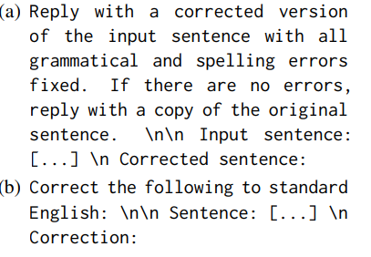
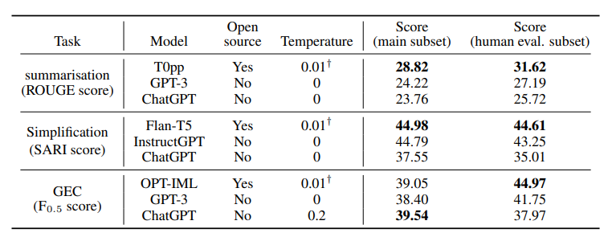
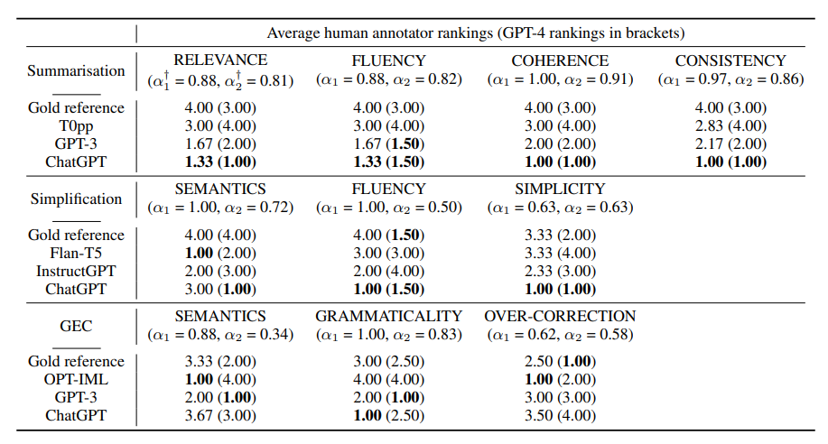

论文题目：**Evaluation Metrics in the Era of GPT-4: Reliably Evaluating Large Language Models on Sequence to Sequence Tasks**

论文链接：https://arxiv.org/pdf/2310.13800.pdf

## 简介

本周阅读的这篇论文接续在上周的论文[Is ChatGPT a Highly Fluent Grammatical Error Correction System? A Comprehensive Evaluation](https://b1leqeja5sp.feishu.cn/docx/PWBSddpUEorrr9xWFLscGXQ2n5g)之后，是EMNLP 2023主会接收的一篇论文。在前一篇论文中，作者指出了**现有的评估方法会低估ChatGPT的性能**，而本文就围绕着这一观点开展了一系列实验，进一步证实了这一观点。

本文的作者来自NetMind AI，该公司开发了机器学习平台NetMind Power（目前还是Beta版）；其中除了袁征教授以外的三位作者都暂时找不到先前相关工作，而袁征老师的研究内容则主要围绕GEC方向，今年还有一篇GEC方向上的Survey（https://arxiv.org/pdf/2211.05166.pdf），个人感觉值得一读。

**本文的主要结论：**

- **传统的基于参考target的评估方法并不能够完全替代人工评判**，导致这一现象的原因可能是这种**评估方法本身存在缺陷**，或**目前的数据集提供的参考target质量太低**，或两者兼有；
- **在人工评估中，一些模型的生成结果甚至会优于数据集提供的参考**，作者认为这一结论指出了目前在评估方法的相关研究中，数据集的质量是最主要的研究瓶颈；
- 在大多数任务中，**GPT-4对模型性能的评估能力与人工评估能力相当**。

比起前篇论文，本文对更多的LLM、在更多的任务上进行了人工和自动的评估，提出了更新颖的一些观点，提供了一些新的工作和思考角度。而和前篇论文类似的是，两篇文章基本都只有实验与结论，没有涉及太多的工程相关内容。个人感觉这篇文章的不足之处是篇幅太短，读下来感觉内容有点少，而且虽然指出了目前评估方法中存在的问题，但实际上并没有太多地讨论该如何优化现有方法或解决这些问题，让未来的工作方向非常宽泛。

## 相关工作

- 在NLP领域中，很难提出一个可靠、稳固的评估方法
  - 有不止一篇相关工作提出过，**自动的评估方法和人工评估的结果之间的关联性很差**（https://arxiv.org/pdf/2303.14342.pdf、https://arxiv.org/pdf/2304.01746.pdf），说明自动的评估方法在LLM上的可信度确实不高；
  - 人工评估的结果可靠，而且能够避免使用自动评估方法带来的偏见（bias）和缺陷（limitations），但与此同时，人工评估也存在**结果很难被复现**等问题；
- 有很多对LLM做出评估的相关工作，但它们只在单个任务、或只对单个模型、或只是在单个数据集上进行了测试，本文是第一次在多个测试集、多任务上对多个LLM进行性能评估的任务；而且，本文在人工、自动两种评估方法的基础上，还使用了GPT-4来评估模型的生成结果
  - 更细粒度地划分，本文还将LLM区分成了开源与不开源两种
  - 本文在文本概括、文本简化和语法纠错三个任务上进行了性能评估

## 实验

- 数据集方面，作者分别选用了Newsela（文本简化任务）、CNN/DailyMail（文本概括任务）、BEA-2019（语法纠错任务）；自动评估则采用这些任务中广泛采用的指标，SARI（文本简化任务）、ROUGE（文本概括任务）和F0.5（语法纠错任务，由ERRANT得到）

- 本文评估的LLM包括开源和不开源两类，开源LLM均来自HuggingFace（Flan-T5、T0pp、OPT-IML、Flan-UL2），不开源则均来自OpenAI（GPT-3、InstructGPT、ChatGPT）

  - 对上述模型的测试均在**zero-shot**的实验设置下进行，不做任何微调

  - 虽然文章中没有详细写prompt的设计方法，但在实际的实验过程中，作者在每个任务中都尝试了多个prompt（文章的附录B.1），也比较了不同prompt产生的模型结果（附录D）

    - 附录D中的详细结果其实也不完整，每个任务只记录了两种prompt的结果差异

    - 特别记录一下本文在GEC任务上使用的prompt：

      

      - 和前一篇文章相比，注意到这里并没有向模型强调“**需要尽可能少地更改句子的原本结构**”，我感觉这一部分的缺失很有可能会让模型更加不遵守最小编辑的规则，从而使over-correction的现象更严重（直觉想法）

- 在人工评估中，作者从每个数据集中随机抽取了100个样本，每个样本包括所有LLM的输出结果和数据集提供的参考gold reference，让三位标注者从多个维度进行打分；这些抽取的样本还交给了GPT-4，令其按照同样的维度进行打分

  - 文本概括任务的评判维度分为：Relevance、Fluency、Coherence、Consistency，这些维度的标准来自https://arxiv.org/pdf/2007.12626.pdf一文
    - Coherence：评判的是模型生成结果的整体质量，要求生成的结果不能只是信息的堆叠，而是结构和编排都比较完善的一条条句子
    - Consistency：衡量模型生成的摘要是否符合原文，要求生成结果中不能含有产生幻觉的句子（与文本相关信息不符）
    - Fluency：评判的是模型生成结果中每一句的质量，要求句子不能出现格式及语法上的错误
    - Relevance：要求模型生成的摘要只含有重要信息，不能出现冗余或不重要的信息
  - 文本简化任务的评判维度分为：Semantics、Fluency、Simplicity，这些维度的标准来自https://aclanthology.org/2022.jeptalnrecital-taln.47.pdf
    - Semantics：要求模型在简化后保留原本的语义
    - Fluency：要求模型生成的简化结果符合语法
    - Simplicity：评判模型的生成结果相较于原文的简化程度
  - GEC任务的评判维度分为：Semantics、Grammaticality、Over-correction，其中的Over-correction来自上周阅读的论文，另外两个由作者定义
    - Semantics：评判模型在语法纠错后是否维持语义不发生变化
    - Grammaticality：是对应于问题“在纠错后的句子中还剩下多少语法错误”的回答，包括了模型未能纠正或新引入的错误两种
      - 特别地，前述的所有分数范围都是在1~5之间，1表示最差，5表示最好；但Grammaticality的得分范围在0~3之间，0表示最好，3表示最差
    - Over-Correction：是对应于问题“系统是否过度纠错或做了不必要的修改”的回答，描述的是虽然纠错结果语法正确，但模型并未遵守最小编辑规则进行纠错的情况
      - 与Grammaticality一样，本指标的得分范围在0~2之间，0表示最好，2表示最差

- 使用传统的自动评估方法的结果如下图所示：

  

  - 实验分别衡量了模型在整个数据集和采样给人工评估的数据集上的表现
  - 由于HuggingFace的设置，LLM的Temperature不能取0，因而在开源的模型中，LLM取了0.01来起到近似0的效果
    - Temperature越大，模型生成的结果越容易发生变化
  - 虽然作者说这里想要比较开源模型和付费模型之间的表现差异，但我个人认为这个并不是本文想要研究的内容。我更倾向于这个数据是为了显示出**LLM在传统评估上的得分普遍不高**这一现象
  - 作者还指出，在每个任务中，同一个prompt能使所有的模型都达到最佳表现；说明prompt的质量与模型种类无关
    - 原文用词是model-invariant，我的理解就是优质的prompt能在所有LLM上起到相同的效果

- 在人工和GPT-4的评估任务中，作者首先按照打分结果对模型进行了排序、给与了1~4的排名，再取均值作为最终的得分；得分越高，模型在这一维度上的表现就越差

  - 因为人工标注者和模型的评判标准可能有个体和主观上的差异，作者采用这种操作来减少这种差异带来的影响

  - 最终的表现如下图所示：

    

    - 可以看出，LLM在人工标注时的得分很高，然而在传统评估时的得分会表现得非常低；反映出**传统的评估体系与人工标注之间确实存在差异**
    - 在三个任务中，由数据集提供的reference的得分都很低，反映出这些**gold reference本身的质量就很差**，甚至比不上模型的生成结果
    - 这里还特地列出了不同标注者的打分结果之间的一致性程度（Krippendorff‘s alpha），越接近1则说明标注者的观点越一致；可以看出标注者对模型的性能评估结果是比较一致的，从而反映出这个结果是信度比较高的
      - 在算上GPT-4的结果后重新计算得到的alpha2略有降低，但是在GEC以外的任务上依旧保持着**比较好的一致性**。
        - 个人感觉在GEC任务上，如何使GPT-4的评估与人工评估达成一致可以是个有意思的研究的方向
    - 注意到ChatGPT的Over-correction问题非常严重，这一结果和前篇论文中的结论是一致的

  - 在https://arxiv.org/pdf/2305.17926.pdf一文中，曾经指出**改变样本的顺序会导致GPT-4的评分产生偏见**，然而在本文中作者并未发现这种问题的存在。作者认为可能是将打分结果转为评级的操作减少了偏见的影响。

- 本文的不足之处：

  - 作者认为本文关于Prompt的设计和研究太少，打算将prompt的质量提升作为接下来的研究目标（还包括few-shot+ICL或CoT等不同方式）
  - 在选取模型的最好参数设置时，作者参考的指标依旧是自动评估的指标；然而既然本文指出自动评估的指标与人类的评估之间存在差异，那么这种参数的选取似乎也是不可靠的，可能存在偏见
  - 一些LLM可能曾经在本实验用到的数据集上预训练过，这有可能会导致最终的性能表现得更好；但是这一点很难改进，因为重新专门构造数据集的成本非常高，而且一些非开源的模型预训练使用的数据也不对外公开
  - GPT-4的评估可能会对ChatGPT的生成结果存在偏好
    - 作者认为存在偏差的原因是它们同属于OpenAI研发的模型，但我觉得这个理由实在有点不充分，不理解
  - 交给人工评估的样本太少，可能会导致实验结果的可靠性变差；但是从本文的实验结果来看，标注者之间的一致性很强（都认为gold reference的表现很差），所以作者倾向认为本文的实验结果是比较可靠的

## 总结

我个人认为本文其实是对**传统的reference-based的评估方法在LLM上不再适用**这一观点的深入研究和展开，作者将人工标注的结果视作参考标准，指出导致这一现象的一方面原因在于**reference本身的质量堪忧**，或在于这种**评估方法自身的缺陷**。这一部分的归因我认为是本文比较值得参考的内容。

不过，我认为本文的缺点也很明显，就是对于这一现象的讨论和归因都没有做得非常深入。作者并没有详细讨论可行的优化方向，也没有深入地分析具体原因（本文几乎没有具体指出这种reference-based方法的缺陷到底是什么，可能仅提供一个reference是这种缺陷的一个具体表现）。

在最后对未来工作方向的讨论上，作者指出可以**将人工的评判方法延伸到大规模的数据集上**，或**提出一种reference-less的评估方法**是可行的解决方案，我认为虽然宽泛但依旧值得考虑。我个人觉得，从**GPT-4的评估结果能够和人工评价达到高度一致**这一点来看，使用LLM来评估其他LLM的表现似乎是个可行的方法，在这方面思考相应的prompt或约束条件是不是也能够看作比较值得研究的topic。