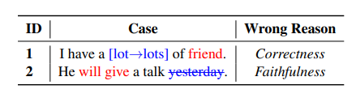
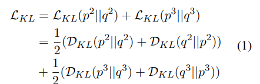
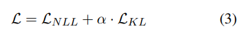
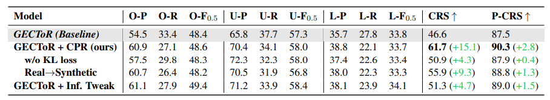

论文题目：**RobustGEC: Robust Grammatical Error Correction Against Subtle Context Perturbation**

论文链接：https://arxiv.org/pdf/2310.07299.pdf

## 简介

由于近期的工作内容一直在gectoolkit上，接触的模型均是传统的预训练语言模型，因此希望搜集在GEC方向上的近期相关研究，学习一下目前仍旧从事PLM研究的相关人员的科研方向。本篇RobustGEC就是今年EMNLP的主会接收的文章，作者是来自西湖大学的张岳教授，先前的研究范围很广，有QA、情感分析等方面的研究，近期也在LLM的性能衡量上发了很多paper。

**本文的主要工作：**

- 提出了**RobustGEC**，一个针对GEC模型的新基准(原文用词benchmark，但读下来感觉具体指代的是人工标注成的新数据集)；
- 提出了**上下文稳定性**(context robustness)的概念，具体是指当上下文发生与语法错误（或纠错对象）无关的变动时，GEC模型维持稳定和准确的能力，是GEC领域中的全新衡量角度。经实验发现，大部分的GEC模型都不具备这种稳定性。此外，文章还从扰动类型、位置、词语频率三个方面研究了语法扰动对模型性能造成影响的方式；
- 提出了即插即用的**CPR**训练方法(Context Perturbation Robust Training)，通过最小化双向KL散度的优化目标，能够有效地提升模型的上下文稳定性。

简单总结来看，本文的研究角度非常新，从之前没有相关研究的GEC的稳定性（鲁棒性）入手，提供了一套比较可靠的评估指标和数据集，同时也提出了易于使用的解决方案。文章中关于context robustness的研究结果很多也很新，可以作为后续GEC模型的优化方向参考。

## 相关工作

- 在NLP领域内的其他任务（QA、NER、SA）上，可以借助对抗文本生成的方式来全自动地生成衡量稳定性的benchmark，同时也有许多提升模型稳定性的研究（包括连续和离散空间两方面）
  - 这一点不太理解，不清楚其他领域内的稳定性是如何定义的、benchmark的运作方式具体如何、以及所谓的离散和连续空间具体所指
  - 在文章的第三部分中详细解释了为什么GEC任务无法使用相同方法生成benchmark的原因：GEC任务对扰动更加敏感，自动构造出的语句可能导致语法错误变得更多或更少（下图所举的例子），由此检测出的稳定性就变得不可信
    - 我个人对这个说法的理解是，作者认为的GEC模型的稳定性是在扰动添加后，依旧维持原本的纠错方案；而如果扰动使得原本的语法错误发生改变或变多，那么一个表现良好的模型的纠错方案大概率（也理应）会发生变化，此时的稳定性就会变得无法衡量。
    - 
- 在GEC任务上，曾经有论文研究过语法错误数量对模型稳定性的影响（ https://aclanthology.org/2020.emnlp-main.228/ ）；此外，还有论文研究过GEC系统的安全性，指出模型很容易受到对抗攻击影响（ https://aclanthology.org/2022.aacl-main.13/ ）。但是，针对上下文的无关扰动对模型性能的影响从未有人研究过
  - 因而现有的GEC benchmark只是从P、R、F0.5的角度衡量模型性能，不存在针对稳定性的衡量指标
  - 对抗攻击：输入样本时添加一些人为干扰，使模型以高置信度输出错误结果（只查到了CV领域上对抗攻击的研究）
- 本文将现有的GEC模型分为了三类：seq2seq、seq2edit、LLM，并选取了总共五个具有代表性模型进行实验

## RobustGEC

- 文章提出的RobustGEC数据集提取自CoNLL-14、BEA-19和TEM-8三个数据集，共5000条
  - 其中，TEM-8是较新的数据集，据文章所说，取自高难度的英语水平考试，因而具有语法错误更难纠正、纠错方法比较固定的特征（challenging and deterministic），其余两个数据集中的语法错误则更多与表达方式有关（expression-related）
  - 选取的语句的平均长度、平均语法错误个数不等，文章认为基于这种数据做出的评估比较全面
- 由于GEC任务对扰动的高敏感度，文章采用了人工标注的方式来添加扰动，允许标注者采用替换、插入、删除的方式做无关的上下文修改，使得每句句子对应5条人工添加了扰动的句子（可以看作另一种意义上的数据增强？）
  - 为保证人工标注的准确性，本文采用了一系列手段（比如对标注者的英语水平要求和一系列筛选，对标注结果的反复讨论和检查等，均是在人力上耗费的大量资源，甚至考虑到了标注者的性别、年龄、国籍等特征），可以认为本文的人工标注是有非常高可信度的
  - 人工标注的两个主要基准：Correctness（扰动不会新增语法错误）、Faithfulness（扰动不会改变原本的语法错误），与前文所述的两个错误类型对应
  - 值得一提的细节是，在人工标注前，先使用了ERRANT提取出每条数据的语法错误的位置及其对应修改方式，保证标注者的改动不会影响这些语法错误
  - 统计发现标注者更喜欢做替代，而非增删，且更喜欢修改名词和动词
    - 文章指出名词和动词经常作为句子的核心组成，但似乎这一统计结论对实验结果并没有影响
- 文章在衡量模型的上下文稳定性的前提下，也同时衡量了模型的语法纠错能力
  - 由于数据集在标注后多出了许多条添加了扰动的句子，衡量时有了更多维度的指标可以参考：扰动会使得模型的纠错性能变好或变差，因而可以查看F0.5的上下界及波动情况（差值）
    - 个人认为最后看来似乎只有差值是可以参考的，上下界作为衡量指标的用处不是很明确
  - 针对稳定性的衡量，提出了两个新的指标：CRS（Context Robustness Score）和P-CRS（Pair-wise Context Robustness Score）
    - CRS = 所有扰动变化中始终维持稳定的案例个数 / 总案例个数，即对每条数据，模型需要在5个扰动变化中始终维持正确纠错，分子计数才会+1
    - P-CRS = 正确纠错的样本数 / 样本个数，即对每条数据，模型在5个扰动变化中正确纠错的个数视作分子
    - CRS相较于P-CRS更为严格，前者是在整个数据集上进行衡量的，而后者似乎是对每个样本及其5个扰动衡量的，最终的P-CRS应该是取均值得到的结果

## 稳定性测试

- 文章使用五个模型在RobustGEC上进行了性能测试：BART（seq2seq）、SynGEC（增添了语法信息的seq2seq）、GECToR（seq2edit）、LLaMA（LLM）、ChatGPT（零样本学习的LLM）
  - 除ChatGPT以外的模型均在CLang8上进行了微调；ChatGPT使用了prompt令其以GEC模型的形式工作，且在调用API时使用了贪婪搜索策略来减少随机性
    - zero-shot：不做任何微调，直接让LLM执行某任务
- 测试结果发现所有的模型的稳定性很差，会在很大程度上受到扰动的影响，F0.5的上下差值均在20个百分点以上，且CRS得分均在50以下
  - GECToR的稳定性在五个模型中表现最佳，分析原因可能是模型只有一个encoder，且预测编辑标签时是独立预测的，不易受到前后文影响
  - seq2seq模型则由于encoder+decoder的架构，会被上下文的扰动影响两遍，包括SynGEC的句法信息也会受到扰动影响
  - LLM的表现最差，文章认为是其参数量大导致其更易受扰动的影响
  - 对实验结果按照数据来源进行划分，发现在TEM-8上的稳固性表现最好，文章认为与数据集的特性有关，即前述的challenge and deterministic errors更不容易受到上下文扰动的影响；但与此同时，模型在另外两个数据集上的纠错性能更佳。文章从而提出，纠错性能和稳定性不存在正向的联系。
- 文章还对扰动影响模型稳定性的方式做了详细研究，有以下结论：
  - 模型在面对替换操作形成的扰动时稳定性最佳，插入、删除操作带来的扰动对模型稳定性的影响更大。文章认为是由于插入和删除操作经常改变句子结构导致的。
  - 扰动发生的位置距离语法错误的绝对位置越近，模型的稳定性受到的影响越大。原因是距离较近的词语通常属于句子结构中的同一部分，语法和语义的关联性可能较大。
  - 在替换操作带来的扰动中，替换后的词语出现频率越低，模型稳定性受到的影响越严重。文章认为这一点反映出，GEC模型可能只是学习了一些文字的特征（虚假的相关性，spurious correlation），并没有真正地理解语义
    - 和seminar中提到的论文 https://arxiv.org/pdf/2305.11383.pdf 提出了相同的观点
  - 个人认为这一部分的研究结果是本文最值得参考的结论，除去下文即将介绍的提升稳固性的方法之外，后续对于GEC领域内的PLM均可以采用这里的结论作为优化方向，举例来说，由于先前提出的SynGEC的语法分析在本实验中的表现并不好，那么在模型中需要融入怎样的信息能够保证句子结构不受扰动影响，便可以作为接下来的研究内容；又或者将其作为GEC任务数据集构建和数据增强的方向参考，个人认为同样可行

## 提升模型稳定性的训练方法 CPR

- 提升模型的稳定性，即意味着希望模型在面对各种扰动时始终维持原本的语法纠错结果。基于此思路，本文提出了一种新的优化方法，要求GEC模型在那些未出现扰动的位置上输出的概率分布在扰动前后保持一致
- 此处的优化方法是最小化双向KL散度（Kullback-Leibler divergence）

  

  - KL散度：又叫相对熵，用于衡量两个概率分布之间的不同程度；两个概率分布越相似，KL散度越小；且KL散度不具有对称性，即对概率分布P、Q，KL(P|Q)与KL(Q|P)不相等
  - 双向KL散度：在R-Drop一文中（https://arxiv.org/pdf/2106.14448.pdf）提出
    
    - 查询资料得到的说法是“将两种分布的位置交换以间接使用整体对称的KL散度”，不是很能够理解这句话的意思；个人的理解是，此处使用双向KL散度则可以在优化时同时优化KL(P|Q)和KL(Q|P)两项，达到P、Q概率分布相似的效果
  - 在原本的NLL损失上再加上这一KL散度损失函数，得到CPR的整体损失函数L，优化目标即是最小化这一损失函数：

    
- 文章还对此实验方法进行了消融实验，在RobustGEC数据集上使用稳定性最佳的GECToR查看CPR方法对其稳定性的进一步提升效果
  

  - 使用了CPR方法的GECToR在CRS得分上取得了巨大的提升，即稳固性变得更强，且并没有影响模型的纠错性能
    - 关于这一结论，我个人存在疑问：使用CPR方法前后的模型，F0.5的上下界差值相近（33.8~57.3，33.7~58.0）**，**可使用CPR方法的模型稳固性得分却更高，也就是说**F0.5的上下界差值并不能反映出模型的实际稳固性，那么这一指标的提出意义和参考价值似乎有些不够明确**
  - 移除KL损失函数后进行训练，发现模型的稳固性提升效果变得不是很显著，说明提升稳固性需要给予其明确的限制条件（explicit constraints），而KL损失函数在提升稳定性方向上是有效的
  - 使用启发式算法全自动生成扰动后的数据集，代替先前的人工标注数据集进行训练，发现模型的稳定性能够有效提升，但效果不如人工标注的数据集；文章认为这一结果说明这种扰动的启发式生成规则是可以考虑使用的，尤其适合在那些无法人工标注数据的场景中使用
  - 由上表数据可见，CPR方法提升了模型的精确率，但降低了模型的召回率。作者提出，如果模型采用保守的修改策略，CRS也可能得到提升（**因为完全不做任何纠错的模型的稳定性一定很强**）；因而设计了对照组，修改了模型推理阶段的bias参数，使KEEP编辑标签的出现概率尽可能大。实验发现，采用更为保守的修改策略只能提升很小的一部分CRS，说明CPR并不是使模型变得保守来提升稳固性的，而是使模型能够容忍那些无关的上下文扰动。

## 总结

苏大NLP的本篇文章角度非常新，文章内容也非常充实，提出的**上下文稳定性**概念为GEC领域内模型的优化提供了新的思路，也借助严格的人工标注构造了新的数据集RobustGEC，还提出了解决模型稳定性差的方法。个人认为Context Robustness是传统F0.5评判指标以外的新优化方向，但也正是因为其作为全新的优化方向，可以参考的范本太少，很难想出合理的优化方案，举例来说“更不容易受上下文扰动的语法纠错模型”或“面向模型稳定性的数据增强方法”等均是可以考虑的主题，但这些idea有些笼统。直觉上来讲，增加模型的结构复杂度或在输入中增添额外特征也许能够提升模型的稳定性，但怎样的数据、怎样的模型结构能够提升稳固性，又需要大量的实验才能得知。

个人认为部分实验和猜想具有可实施性和可验证性，却没能在文章中表现出来，举例来说：本文虽然通过实验测试了LLM的稳定性，指出LLM的稳定性较差，也提供了优化的方向和思路，但第五部分的实验效果仅仅展示了在传统的PLM上的优化效果；在讨论扰动对模型稳定性的影响方式篇章中，虽然对各实验结论进行了合理的归因，但如何借助实验验证这些猜想、设计方案进行优化，均是值得探讨的科研方向。