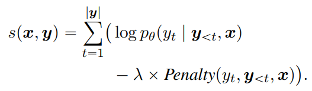
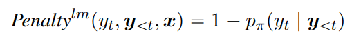
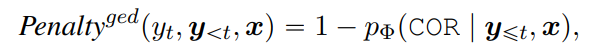
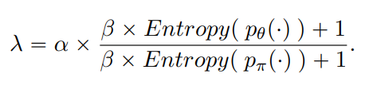
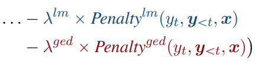
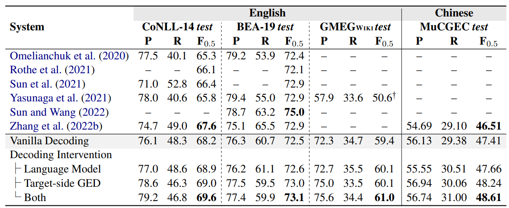
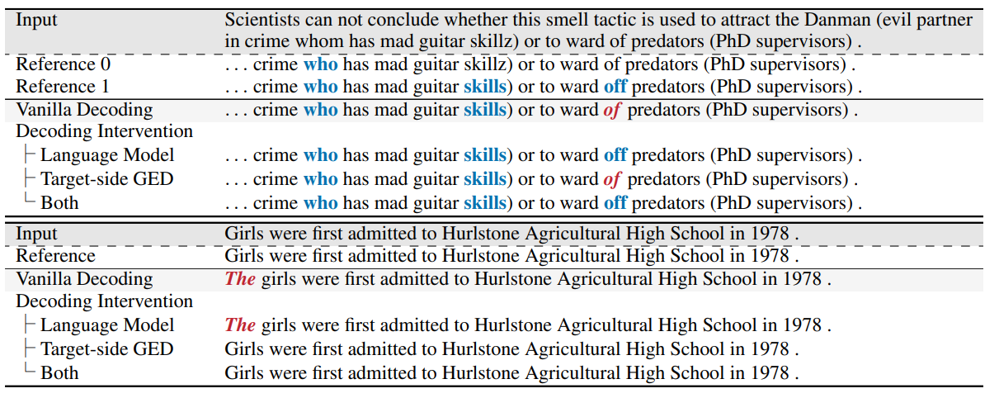
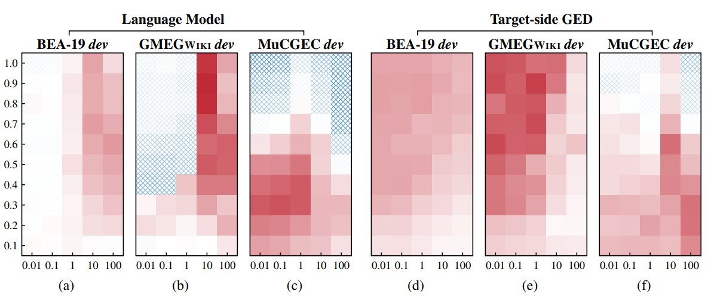

论文题目：**Improving Seq2Seq Grammatical Error Correction via Decoding Interventions**

论文链接：https://arxiv.org/pdf/2310.14534.pdf

## 简介

本文是EMNLP2023的findings接受的文章，同样是围绕着GEC领域中的PLM模型性能的优化进行的研究。作者来自苏州大学，先前的研究的主要方向是词性标注任务（POS tagging）。

**本文的主要工作：**

- 提出了一种在Seq2Seq模型**解码阶段进行干预**的优化方法，通过**添加惩罚项**来增添模型生成词项时的正确率，成功提升了模型的性能；
- 提出了两种不同类型的critic：**从左到右的语言模型**（left-to-right LM）和**输出端的GED模型**（target-side GED），作为计算生成词的得分时的惩罚项。

本文虽然也是围绕着预训练语言模型的性能优化展开的相关研究，但和上周的Template及大多数的论文所使用的思路不同，不再向encoder端输入额外信息，转而开始作用于模型的decoder端。文章中提出的target-side GED模型也是一个创新点，不再在纠错步骤前进行错误检测，而是在纠错步骤中对生成结果进行正误的分类。

## 相关工作

- Decoding intervention的相关工作分为两类
  - 较早期的编码干扰方法是通过在大规模数据集上训练的LM干预模型的解码阶段，通常是用来缓解缺乏平行数据的问题的，运用于机器翻译和自动语音识别任务中较多
    - 我的理解是，由于缺乏平行数据，模型的生成表现不佳，因此在解码阶段使用预训练的语言模型提升生成的性能
    - 这种decoding intervention的方法和文中提出的一种方法类似，但本文是第一次将这种方法用在GEC任务的模型优化上；曾有GEC任务使用这种方法，但目的是为了调整precision和recall的平衡，与本文的动机不同
  - 近期的编码干扰方法运用在可控文本生成任务中较多，用于控制模型生成结果的主题和情感等
- 在近期的研究中，Seq2Seq模型的表现均优于Seq2Edit模型（https://aclanthology.org/2022.naacl-main.143.pdf、https://aclanthology.org/2022.emnlp-main.162.pdf），尤其在面对更复杂的任务时这种现象会更加明显
  - 这一点和TemplateGEC中提出的结论相同，从近期的研究中也可以感受到，围绕Seq2Edit模型进行的优化研究很少，可能也和其**迁移性差、不灵活**的缺点有关，导致了模型的性能优化很难开展
    - 适用于Seq2Edit模型的优化方向：更好的编辑规则的设计或额外信息的输入（？）
    - 理论上来说，我认为在decoder端的这种干预方法应该也能对Seq2Edit模型奏效，但本文只在Seq2Seq上做了实验验证
  - 然而，Seq2Seq依旧存在两个主要缺点：**训练需要的平行语料质量较差**（噪声多、数量少），**模型不具备判断生成的token是否正确的能力**
    - 本文的动机
    - 作者在文中说他们提出这个方法是为了"address **both** issues of the Seq2Seq GEC approach"，但读下来感觉其实只增强了模型对解码端生成结果的判断能力，和缺乏平行语料这一缺陷没什么关系。可能和前面提及的decoding intervention使用在MT上的原理类似，以提升性能的方式变相地解决数据集的需求。

## Decoding Intervention

- 主要逻辑如上图的式子所示，就是在原本的概率分布上增添一个惩罚项，从而起到影响模型生成结果的作用
- 这种解码干预的方法有两个特点：**递进**（incremental）、**动态**（dynamic）
  - 递进：与Seq2Seq解码时逐字推理的过程类似，解码干预也是逐字进行评估的
  - 动态：解码干预是在解码步骤中进行的，并非评估生成完毕的若干句子
- 作者提出了两种不同的惩罚项，分别由**从左到右的预训练语言模型**和**目标端的GED模型**计算得到
  - **Pre-trained left-to-right language model critic**：使用从左到右的预训练语言模型，对模型的生成结果进行概率计算
    - 

    - **Left-to-right language model**：基于前面生成的结果来计算接下来生成的词语概率，和Masked language model不同
    - LM得到的概率越低，惩罚项的值越大
    - 这种方法不会参考输入的句子，因此不能保证最终生成的句子的语义与输入句子的语义一致，只会从语法角度上评估生成结果的好坏
      - 有悖于GEC任务的基本要求，纠错前后的句子语义不应当发生改变
      - 这里不使用原句可能是因为Left-to-right LM模型本身的性能所限，只能做到评估语句本身是否正确
    - 即便GEC模型的生成结果中某一词语的概率很高，只要这个LM给出的概率很低，就说明这个生成词有可能是错的，就会调整该词语的最终概率
    - 实验最终使用的是GPT-2，不需要再进行额外训练
  - **Incremental target-side GED critic**：
    - 

    - 和encoder端使用的GED模型（TemplateGEC的做法）不同，这里在解码的输出端使用了GED模型
    - 这里的GED模型会对模型生成的词语进行**四分类**，对应正确（COR）、多余错误（RED）、替换错误（SUB）、缺失错误（MISS）
      - TemplateGEC的消融实验提到的GED四分类标签应该就是这四个
    - 这种方法必须参考输入的原句，否则GED模型会将很多词项都看作是正确的生成结果
    - 这里使用的GED模型需要进行额外训练
      - 这里的训练数据不能直接使用GEC的训练数据，因为target语句全都是正确的生成结果；只能使用其他的GEC生成的可能含有错误的纠错结果来作为这个GED模型的训练数据
        - 个人理解是因为这个target-side GED任务需要做到的是基于原句和已生成的token，来对接下来生成的token进行四分类任务；完全正确的生成结果可能无法使其学到负类的分类结果
- 惩罚项前的系数是动态设置的，受两个模型得到的概率分布的影响
  - 

  - 原文中的描述是比较两个模型的可信度（confidence），因为模型的可信度与它预测结果的准确率之间存在很强的关联
    - 这一点无法理解，什么叫模型的可信度？在系数的计算公式中分别计算的是两个概率分布的熵
  - 这里的alpha和beta参数是在给定的范围中选取的，在实验中选择的是表现最好的参数组合
  - 在实验中还设置了一组同时使用两个惩罚项的模型，计算方式上没有区别，只是多减去一个惩罚项
    - 

    - 这里的两个lambda使用了不同的符号，可能是alpha和beta的选取上产生的差异

## 实验

- 实验分别使用了中文和英文数据集，其中英文数据集选取了BEA-19、CoNLL-14、GMEG-wiki，中文数据集选取了MuCGEC
  - 上述列出的都是测试集，训练baseline模型使用的训练集是CLang8（英文）和HSK+Lang8（中文）
- 实验用到的基准模型是BART，基于baseline改变了解码阶段的干预方式，测试了不同情况下的模型性能
  - 

  - 发现解码干预的方法在所有数据集上都能提升模型的表现，基于LM的解码干预方法能够提升模型的Recall值，而基于输出端GED的解码干预方法能够提升模型的Precision，两者都使用的解码干预方法会更大程度上地提升模型性能
    - 从GEC任务更看重Precision而非Recall的特性来看，输出端GED的解码干预方法更符合任务要求一点
  - 文章还举了具体的纠错案例进行说明，指出LM的解码干预方法能够帮助GEC模型纠正训练时没有见过的错误（案例1），但可能会修改句子的语义（案例2）
  - 
- 在消融实验部分，作者分析了**解码干预的模型规模、动态系数及参数alpha、beta改变时的模型稳定性**三个方面
  - 在BEA-19和CoNLL-14这种非英语母语使用者的数据集上，解码干预使用的模型大小不会带来明显的性能差异；而在GMEG-wiki这种英语母语使用者的数据集上，使用更大的模型能够提升一定程度的表现。作者认为是非英语母语使用者构成的数据集比较简单，使用较小的参数量也能够完成学习；而来自英语母语使用者的数据集比较难，更大的参数量能够帮助模型更好地掌握纠错能力。
  - 移除lambda的动态选取方法，转而使用固定的lambda后，解码干预给模型带来的性能提升有限。作者认为，这是因为LM和GED两种方法各有其倾向性：它们在提升P或者R中的某一项时，可能会减少另一项，从而导致模型整体的性能提升受到影响。采用动态的lambda选取方法后，能够抑制这种减少的情况发生，从而更好地提升模型性能。
  - 在分析解码干预方法的稳定性时，作者采用了热力图的方式进行描述（红色表示模型性能更佳，蓝色标识模型性能变差）。如图所示，相较于GED的解码干预方法，LM的解码干预方法对alpha和beta的选取变化更为敏感。
  - 
- 模型的缺点在于解码效率变得更低，实际上也是一种速度和性能的trade-off

## 总结

本文的最大亮点在于直接干预模型的解码阶段，个人感觉可以看作和TemplateGEC相对应的一篇文章，因为后者的优化方案实质上是对encoder的修改，恰巧对应于本文对decoder的修改。因为模型缺乏对生成结果的好坏判断，就提出方案帮助模型进行判断，本文的优化方案提出的动机和实验设计都很符合逻辑，优化的方式也很直接，算是比较好理解的一篇文章。

算上这篇论文，还有之前的RobustGEC和TemplateGEC，近期已经阅读了三篇围绕PLM在GEC任务中的性能优化的论文。个人感觉在PLM+GEC方向上的研究重点就是性能，想方设法地从各方面帮助模型更好地捕获到纠错文本的特征，错误分布、句法结构、生成结果的正确性等等方面。如果还希望在这方向上研究的话，也许需要先找到适合融入模型的文本特征（譬如词性，但今年有一篇CSynGEC的相关工作，是SynGEC的后续任务，不知道是否已经实现了融入词性的CGEC模型）。另外，不知道有没有系统地研究过提升模型生成结果的流畅性的相关工作，似乎很少在GEC任务上探究流畅性这一指标，Seq2Seq模型的生成结果貌似也足够流畅了。

简单浏览了一些近期的GEC+LLM的文章，计划之后适当了解一些LLM上GEC研究的近况。