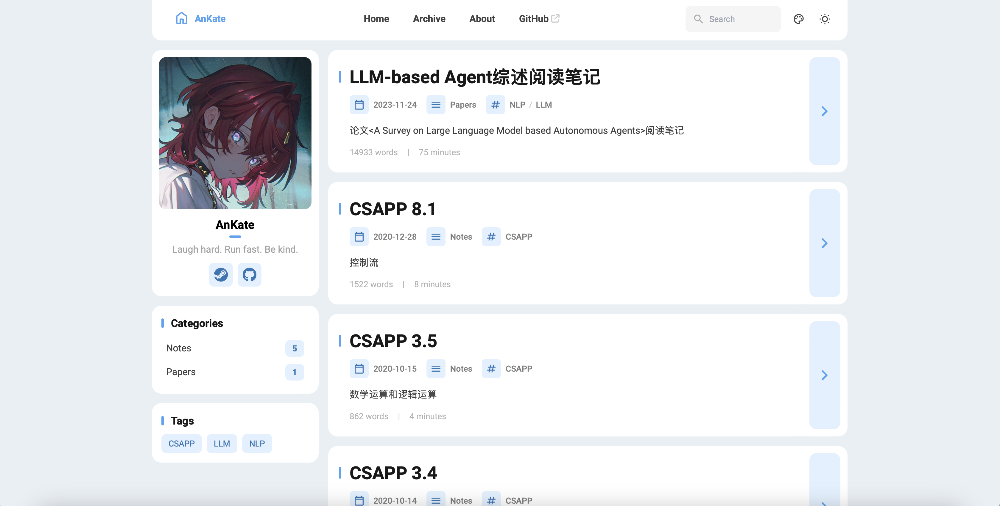
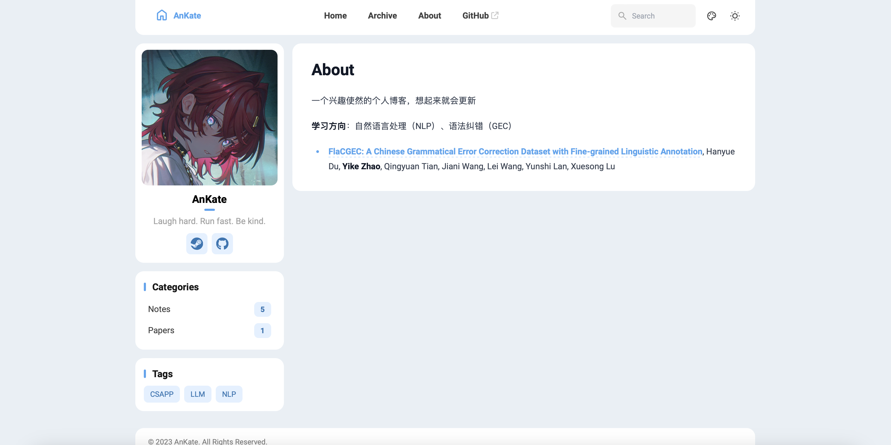
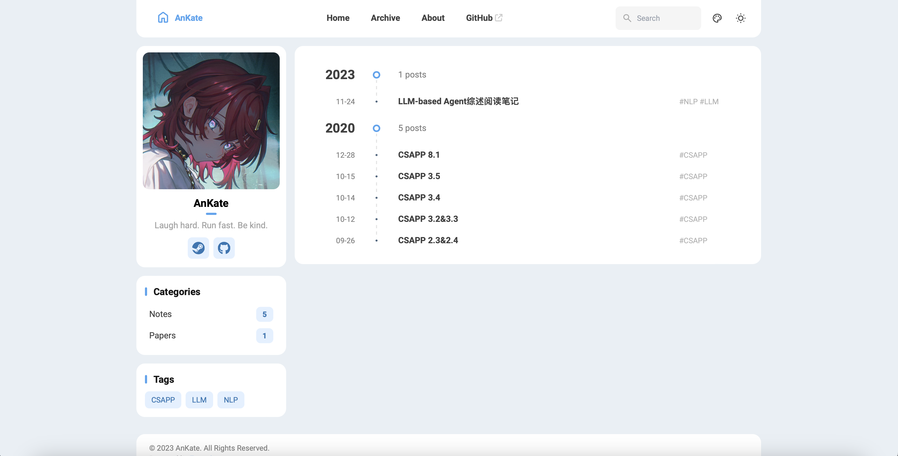
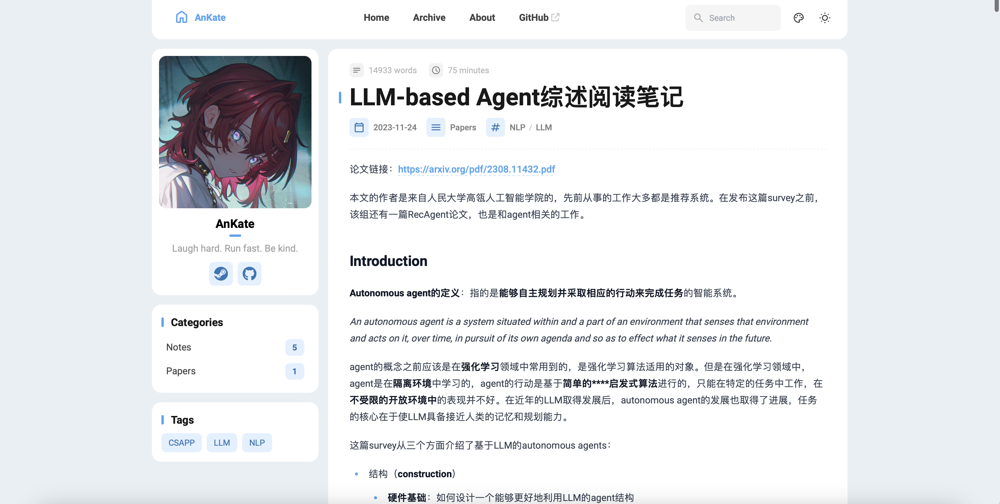
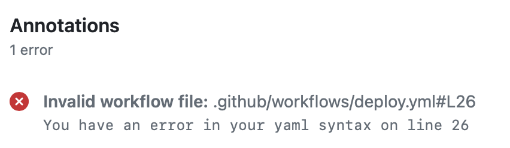

## 静态网页博客搭建总结报告

本次作业使用了[Fuwari框架](https://github.com/saicaca/fuwari/tree/main)，该框架基于Astro和Tailwind CSS开发，页面配置等文件使用TypeScript语言进行编写。

原本的博客使用的是Hexo框架，但由于本地文件丢失，所以选择了页面设计比较美观流畅的Fuwari框架，重新搭建了博客并上传了一部分原本的博文。


### 页面展示

#### 首页



#### About Me页面

点击首页上的头像或导航栏内的About即可进入该页面。



#### Archive页面

点击导航栏内的Archive即可进入按时间顺序的博客归档页面，点击侧边Categories或Tags则可以查看筛选后的博客归档。



#### 博客正文页面




### 技术总结

#### 框架选择

博客使用的框架是基于Astro编写的，其中页面配置主要使用TypeScript语言进行编写。使用的语言虽然相对陌生，但是由于相关的技术文档（[Fuwari文档](https://github.com/saicaca/fuwari/blob/main/README.zh-CN.md)、[Astro部署](https://docs.astro.build/zh-cn/guides/deploy/)）编写的非常详细，且框架内的代码封装的比较好，所以部署过程其实没什么难度。

这也间接导致了该框架的可扩展性比较差，如果考虑增添新的页面或功能，就需要手动编写Astro或TypeScript的文件，不过本博客只是用来存储一些笔记，所以目前实现的功能也已经足够。


#### 部署

博客仓库直接fork自Fuwari仓库，内容与本地一致，不会出现hexo框架中博客仓库内容和本地内容不一致的问题，所以也**不会因为本地文件丢失而导致博客无法恢复**。博客页面内容的主要配置位于`src/config.ts`文件中，实际上搭建博客时只需要修改该配置文件的对应属性即可，非常简单。

本地使用`npm install pnpm`安装管理依赖项的`pnpm`工具，使用`pnpm install & pnpm add sharp`完成依赖的安装。

创建新文章时，直接在该仓库文件夹下使用`pnpm new-post <filename>`即可自动在`src/content/posts/`下生成对应的markdown文件。个人页面的内容文件位于`src/content/spec`目录下，同样以markdown形式编写。

进行博客的更新前，需要先在`.github/workflow/`目录下完成`deploy.yml`文件的编写，这一步是搭建过程中问题主要出现的步骤，很容易出现因为该文件编写有误而无法将博客正常部署到网页的问题。

我的配置文件内容如下：

```yaml
name: Deploy to GitHub Pages

on:
  # 每次推送到 `main` 分支时触发这个“工作流程”
  # 如果你使用了别的分支名，请按需将 `main` 替换成你的分支名
  push:
    branches: [ main ]
  # 允许你在 GitHub 上的 Actions 标签中手动触发此“工作流程”
  workflow_dispatch:

# 允许 job 克隆 repo 并创建一个 page deployment
permissions:
  contents: read
  pages: write
  id-token: write

jobs:
  build:
    runs-on: ubuntu-latest
    steps:
      - name: Checkout your repository using git
        uses: actions/checkout@v4
      - name: Install, build, and upload your site
        uses: withastro/action@v2
        with:
          # path: . # 存储库中 Astro 项目的根位置。（可选）
          # node-version: 20 # 用于构建站点的特定 Node.js 版本，默认为 20。（可选）
          package-manager: pnpm@latest

  deploy:
    needs: build
    runs-on: ubuntu-latest
    environment:
      name: github-pages
      url: ${{ steps.deployment.outputs.page_url }}
    steps:
      - name: Deploy to GitHub Pages
        id: deployment
        uses: actions/deploy-pages@v4
```

完成该文件的配置后，需要在博客仓库的设置中将"Build and deployment"调整为"Github Actions"。

本地更新后，将文章推送至博客的流程与更新github仓库代码的流程一致，但push后需要等待workflow完成推送，才会在博客首页看到更新后的博文。可以在仓库的Action页面查看workflow的工作情况及失败原因（多半是deploy.yml的编写有误，或者文章中的图片引用有误等原因）。



若workflow没有报错，那么更新的流程应该就已经成功执行，可以进入博客页面查看新上传的文章了。